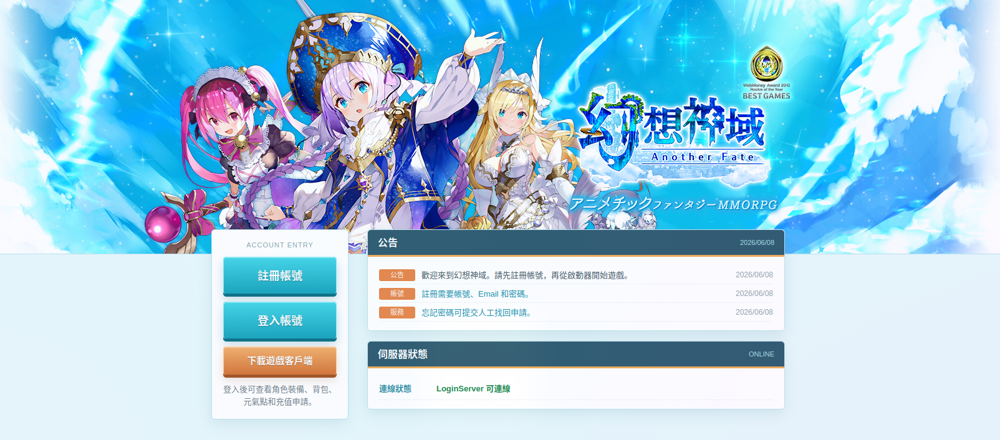
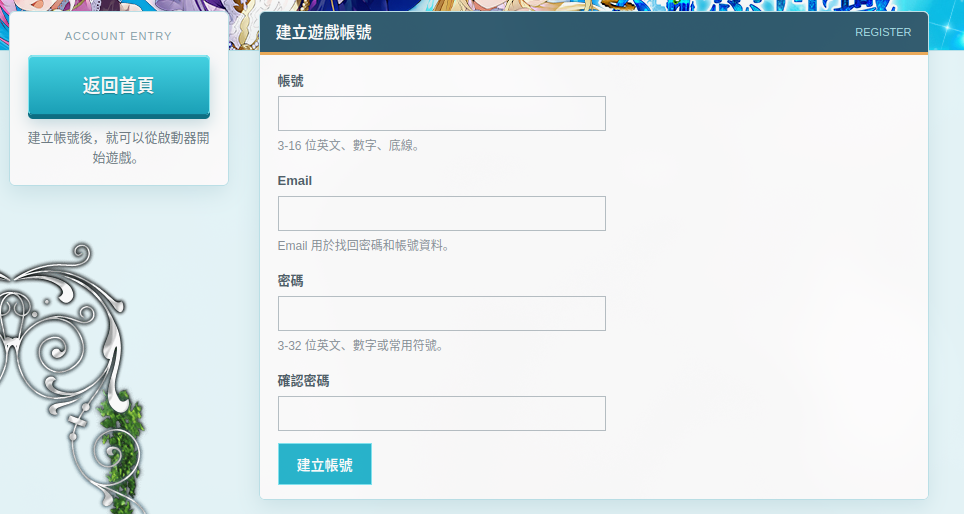
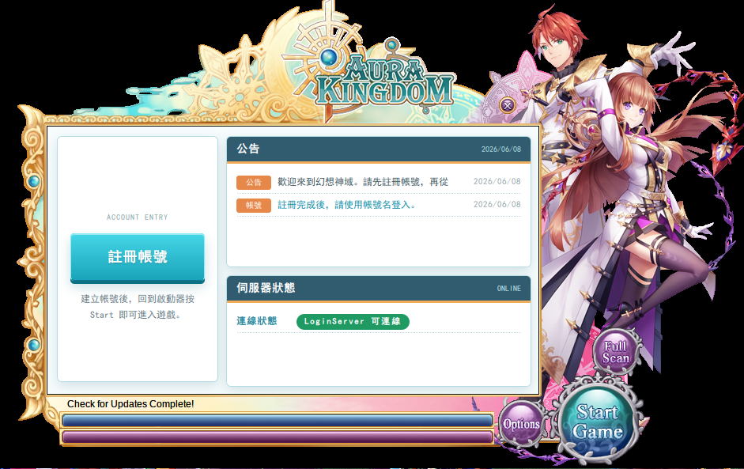
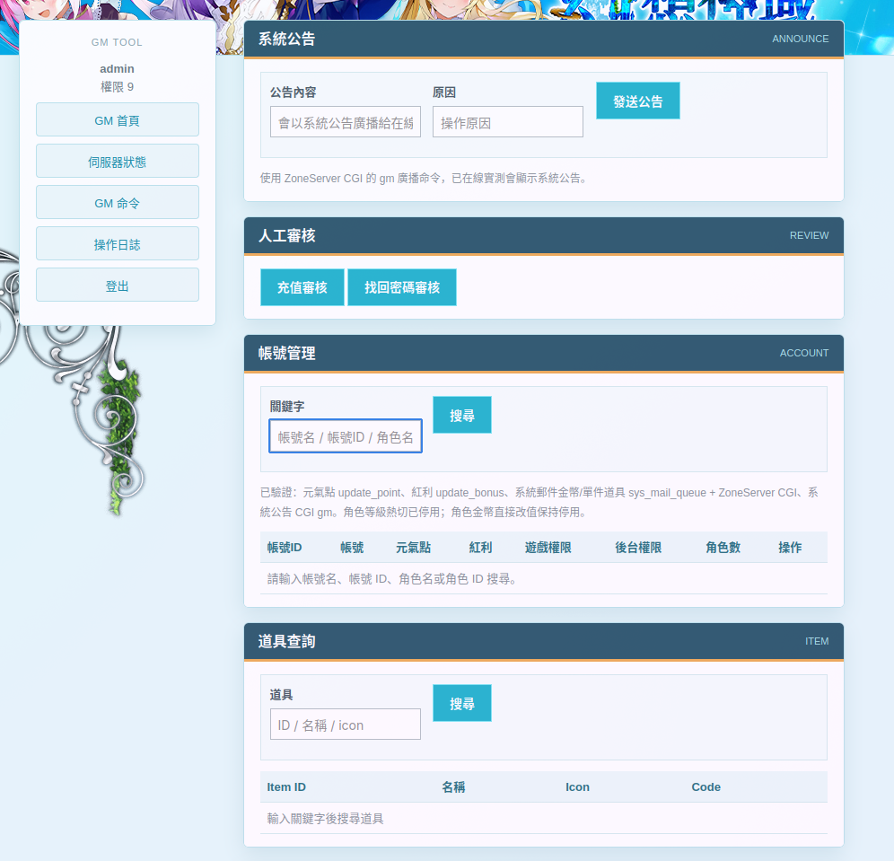
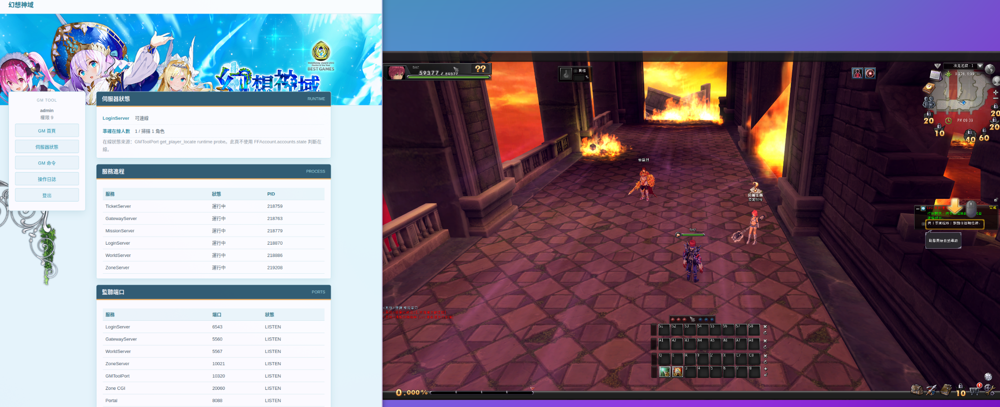
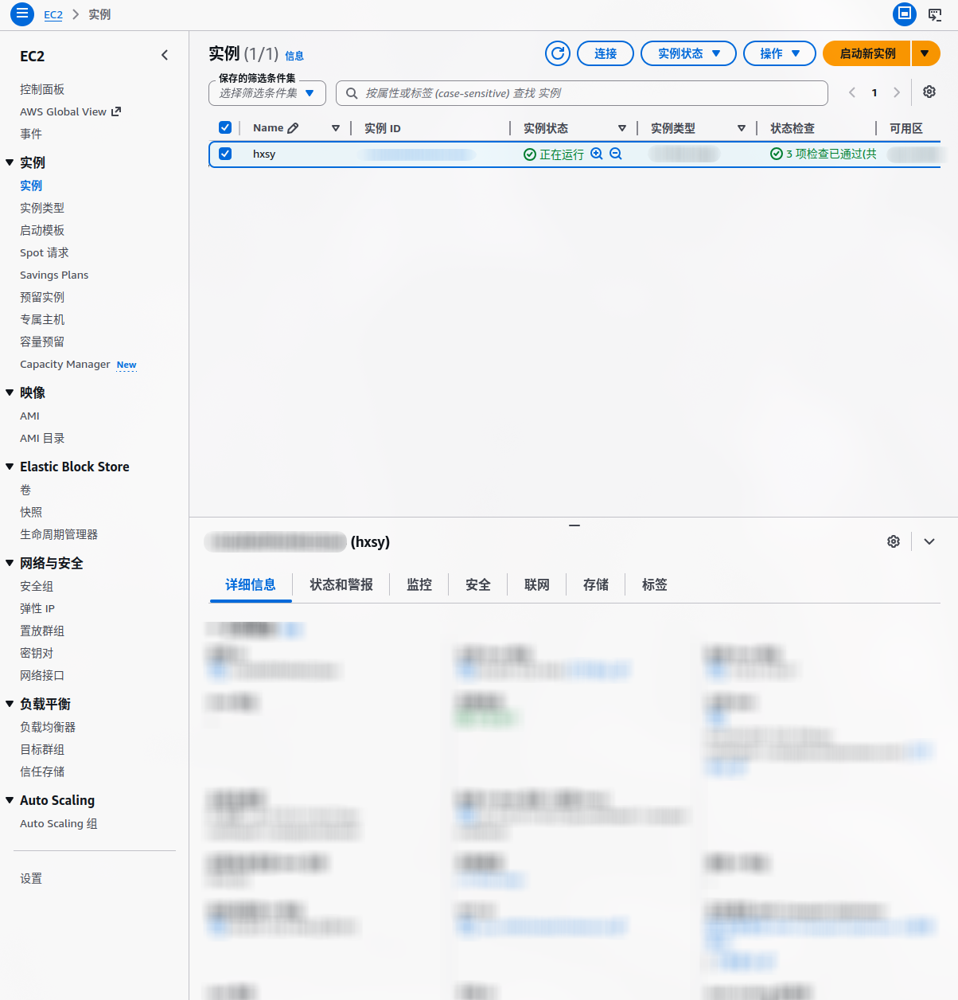

# hxsy-open

AI 辅助部署《幻想神域》局域网或互联网服务器的开源整理项目。



## 免责申明

由于中国大陆的《幻想神域》游玩环境和代理环境较复杂，本项目基于 `幻想神域v15 18职业单机版` 整理出一个方便在局域网或互联网服务器上部署的版本。

核心目的是让想一起游玩《幻想神域》的朋友，可以在自己的 Linux 环境中搭建一个学习、怀旧和娱乐用途的服务器。

本项目无偿分享，仅用于朋友之间的娱乐和学习，禁止用于私服牟利。任何妄图以私服牟利的行为都将自行承担法律风险。

## 下载

完整包较大，不直接放在 GitHub 仓库内。下载后建议校验 SHA256。

| 类型         | 链接                                                                                                               |
| ------------ | ------------------------------------------------------------------------------------------------------------------ |
| Google Drive | [hxsy-open-20260619.tar.7z](https://drive.google.com/file/d/1BBeh75O3u3-93B_cDu1dT05KE5TUOuhi/view?usp=drive_link) |

SHA256:`616cb2215e11cc9ea03b9bf8b8f933bc422eec4bd4905566e1121ad7f715ab11`

校验示例：

```bash
sha256sum -c hxsy-open-20260619.tar.7z.sha256
```

## 文件介绍

完整包解压后的 `hxsy-open` 目录中存放着所有重要文件。

| 目录     | 说明                                            |
| -------- | ----------------------------------------------- |
| `client` | Windows 客户端和启动器。                        |
| `server` | 游戏服务端、数据库 SQL、portal 官网和补丁接口。 |
| `docs`   | 局域网部署、公网部署、维护和排障文档。          |
| `assets` | 与部署无关的资源文件，如图片、解包工具等。      |

## 使用方法

核心：使用 AI 助手根据 `docs` 中的部署文档为你完成搭建。

### 需要准备的环境

| 环境       | 说明                                                                                  |
| ---------- | ------------------------------------------------------------------------------------- |
| Linux 系统 | 可以是实体机 Linux、虚拟机 Linux，也可以是云服务器 Linux。推荐 Ubuntu 或 Arch Linux。 |
| AI Agent   | Codex、OpenCode、OpenClaw、Hermes 或其他能操作电脑/SSH 的 AI Agent。                  |
| 大模型 API | 经过验证的有 GPT-5.5、GLM-5.1。其他模型理论上也可以，只要能稳定阅读并执行部署文档。   |

### 开始部署

准备好环境之后，在 Linux 环境中打开 AI Agent，或者在 Windows 上打开 AI Agent 并让它通过 SSH 连接 Linux 环境。

然后让 AI 根据 `docs` 中的部署文档进行搭建即可。

从这两个文档开始：

| 场景            | 文档                   |
| --------------- | ---------------------- |
| 局域网/本地部署 | `docs/部署至局域网.md` |
| 公网服务器部署  | `docs/部署至服务器.md` |

## 浏览器界面

部署完成后会有以下功能。

### 首页

访问 `localhost:8088` 可以打开首页，能够注册账号、下载游戏、登录账号并查看状态。


### 注册

玩家可以通过网页注册游戏账号。



### Launcher

启动器页面提供服务器状态、注册入口和启动入口。



### 用户后台

在首页登录账号后可以进入用户后台，查看当前角色信息。

`充值申请` 功能可以向 GM 发送充值元气点请求，GM 在后台审核通过后为账号充值元气点。

### GM 后台

让你的 AI 助手根据文档里的方法创建 `WebGM账号`。

如果不给 AI 用户名和密码，默认用户名通常是 `admin`，密码会随机生成，请自己保存好。

访问 `localhost:8088/gm` 进入 GM 后台，可以发送系统公告、充值元气点、封禁角色、管理角色 GM 权限、发送邮件等。



## 部署效果




